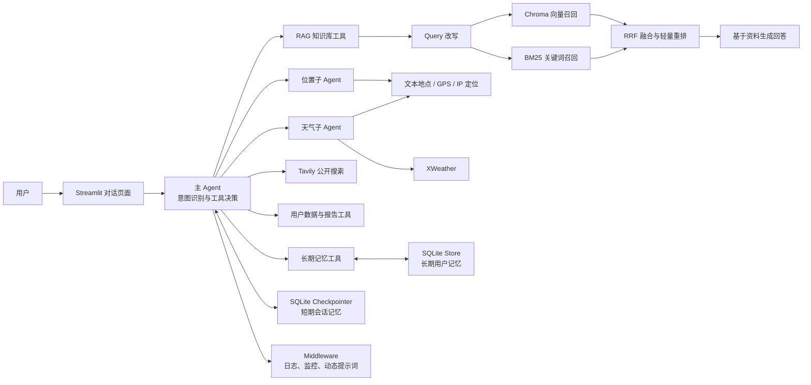
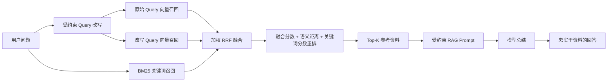

<div align="center">

# 🤖 智扫通机器人智能客服

### SmartSweep Support Agent

基于 **LangChain Agent、混合检索 RAG、多 Agent 工具协同与 SQLite 记忆系统** 构建的扫地机器人售后智能客服原型。

<p>
  
  
  
  
  
</p>

**专业知识库问答 · 故障诊断 · 天气与位置工具 · 用户记忆 · 月度报告 · 流式交互**

</div>

---

## 📖 项目简介

**智扫通机器人智能客服**不是一个只会调用大模型回答问题的普通聊天机器人，也不是一个固定执行“检索后生成”的单一 RAG 程序。

项目以 **Agent 作为决策中心**。Agent 会先识别用户需求，再自主判断是否需要调用知识库、位置、天气、互联网搜索、用户数据或记忆工具，并根据工具返回结果继续完成回答。

当前系统主要面向以下业务场景：

- 扫地机器人与扫拖一体机器人的使用咨询；
- APP 登录、设备绑定、回充失败等常见故障排查；
- 滚刷、边刷、滤网、尘盒与电池的维护保养；
- 温度、湿度和降雨对设备使用的影响；
- 用户历史偏好、设备型号等长期信息记忆；
- 用户月度使用记录查询与报告生成；
- 内部知识库未覆盖时的公开互联网信息检索。

> 项目的本质是：  
> **将 RAG、工具调用、子 Agent、短期会话记忆和长期用户记忆组合成一个能够自主决策的企业售后客服 Agent。**

---

## ✨ 核心能力

| 能力 | 实现说明 |
|---|---|
| 🧠 Agent 自主决策 | 使用 `create_agent` 构建主 Agent，由模型根据用户意图选择工具，而不是每次固定执行 RAG |
| 📚 混合检索 RAG | 组合 Query 改写、Chroma 向量召回、轻量 BM25 关键词召回、RRF 融合与二次重排 |
| 🔄 增量知识库同步 | 使用 SHA-256、确定性向量 ID 和 SQLite 文档清单管理新增、修改、删除及异常修复 |
| 🧩 多 Agent 协同 | 将位置查询和天气查询封装为独立子 Agent，由主 Agent 按意图委派 |
| 🌦️ 位置与天气 | 支持文本地点、前端 GPS、客户端 IP 等位置来源，并调用 XWeather 查询实时天气 |
| 🌐 安全互联网搜索 | 使用 Tavily 查询公开资料，并对隐私数据、危险 URL 和外部提示词注入进行过滤 |
| 💬 短期会话记忆 | 使用 SQLite Checkpointer 按 `thread_id` 保存多轮会话状态 |
| 🗃️ 长期用户记忆 | 使用 SQLite Store 按 `user_id` 隔离保存用户偏好、设备信息和长期约束 |
| 📊 报告场景切换 | 通过 Middleware 动态切换报告提示词，并读取演示用户的月度使用数据 |
| 🛡️ 中间件监控 | 记录模型和工具调用状态，对搜索词等敏感参数进行摘要化日志处理 |
| ⚡ 流式页面交互 | Streamlit 页面实时展示 Agent 输出，并保存完整消息历史 |

---

## 🏗️ 系统架构



---

## 🔍 Agent 工作流程

```text
用户输入
   ↓
主 Agent 识别需求
   ↓
检查是否缺少必要信息
   ↓
选择合适的工具或直接回答
   ├─ 专业故障与维护问题 → RAG
   ├─ 当前所在地查询 → Location Agent
   ├─ 实时天气与湿度 → Weather Agent
   ├─ 最新公开资料 → Tavily Search
   ├─ 用户报告 → 用户数据工具 + 报告提示词
   └─ 跨会话稳定信息 → 长期记忆工具
   ↓
检查工具返回结果
   ↓
继续调用、追问或生成最终回答
   ↓
Streamlit 流式展示
```

主 Agent 不会为了展示功能而无条件调用所有工具，而是根据问题类型决定最短、最可靠的处理路径。

---

## 📚 RAG 检索流程

项目中的 RAG 被封装为 `rag_summarize` 工具，由 Agent 在需要专业知识时调用。



### 当前检索配置

配置文件位于 `config/chroma.yml`：

| 参数 | 当前值 | 作用 |
|---|---:|---|
| `k` | 6 | 最终返回的参考分块数量 |
| `max_rewrites` | 2 | 最多生成的互补检索 Query 数量 |
| `dense_candidates_per_query` | 12 | 每条 Query 的向量候选数量 |
| `keyword_candidates` | 12 | BM25 关键词候选数量 |
| `fusion_candidates` | 24 | 融合后进入重排的候选上限 |
| `rrf_k` | 60 | RRF 排名融合平滑参数 |
| `chunk_size` | 200 | 文本分块大小 |
| `chunk_overlap` | 20 | 相邻分块重叠长度 |

Query 改写会尽量保留型号、数字、缩写、故障码和否定含义；如果改写失败或结果不符合约束，系统会自动退回原始 Query。

---

## 🔄 知识库增量同步

知识文件默认放在 `data/` 目录，目前支持：

```text
.txt
.pdf
```

同步过程不是简单地重复向 Chroma 写入数据，而是通过 SQLite 文档清单维护文件与向量分块之间的关系。

| 文件状态 | 系统行为 |
|---|---|
| 新文件 | 解析、切分、向量化，并写入文档清单 |
| 内容未变化 | 跳过重复嵌入，同时检查分块是否完整 |
| 内容发生变化 | 写入新版本分块，再删除旧版本分块 |
| 文件被删除 | 删除对应清单记录和全部旧向量 |
| 导入中断或分块缺失 | 使用确定性向量 ID 在下一次同步时安全修复 |
| 旧导入机制遗留孤儿向量 | 自动识别并清理 |

这种设计可以减少重复向量、避免多次导入产生重复结果，并使知识库更新过程具备更好的幂等性。

---

## 🗂️ 项目结构

```text
.
├── agent/
│   ├── react_agent.py                 # 主 Agent 创建、上下文注入与流式执行
│   ├── memory/
│   │   ├── persistence.py             # SQLite Checkpointer 与 Store 生命周期
│   │   └── long_term.py               # 长期记忆保存、查询、删除及用户隔离
│   └── tools/
│       ├── agent_tools.py              # RAG、用户数据、日期与报告相关工具
│       ├── location_weather_agents.py  # 位置 Agent 与天气 Agent
│       ├── weather_tool.py             # 地点解析、IP 定位与天气查询
│       ├── tavily_tools.py             # 公开互联网搜索与隐私安全检查
│       └── middleware.py               # 工具监控、模型日志、动态 Prompt
│
├── rag/
│   ├── rag_service.py                 # 检索结果组织与 RAG 生成链
│   ├── retrieval.py                   # Query 改写、BM25、RRF 与重排
│   ├── vector_store.py                # Chroma 初始化与知识库增量同步
│   └── document_manifest.py            # SQLite 文档导入清单
│
├── model/
│   └── factory.py                     # Chat Model 与 Embedding Model 工厂
│
├── prompts/
│   ├── system_prompt.txt              # 主 Agent 系统提示词
│   ├── rag_summrize_prompt.txt        # RAG 忠实总结提示词
│   └── report_prompt.txt              # 月度报告提示词
│
├── config/
│   ├── agent.yml                      # 记忆数据库和外部数据路径
│   ├── chroma.yml                     # Chroma、切分和检索参数
│   ├── rag.yml                        # 对话模型与 Embedding 模型
│   └── prompts.yml                    # Prompt 文件路径
│
├── data/
│   ├── external/records.csv           # 演示用户月度使用数据
│   ├── index/                         # 文档导入清单数据库
│   ├── memory/                        # 短期与长期记忆数据库
│   └── *.txt / *.pdf                  # 扫地机器人知识库文件
│
├── tests/                              # 文档导入、检索、记忆、天气和搜索测试
├── utils/                              # 配置、文件、日志、路径和 API 客户端工具
├── app.py                              # Streamlit 页面入口
├── pyproject.toml                      # 项目依赖和 Python 版本
└── uv.lock                             # uv 依赖锁定文件
```

---

## 🧰 技术栈

| 分类 | 技术 |
|---|---|
| Agent 框架 | LangChain Agents、LangGraph |
| 对话模型 | DeepSeek，当前配置为 `deepseek-v4-flash` |
| Embedding | DashScope `text-embedding-v4` |
| 向量数据库 | Chroma |
| 文档加载 | PyPDFLoader、TextLoader |
| 文本切分 | RecursiveCharacterTextSplitter |
| 检索增强 | Query Rewrite、Dense Retrieval、BM25、RRF、轻量重排 |
| 短期记忆 | LangGraph SQLite Checkpointer |
| 长期记忆 | LangGraph SQLite Store |
| 外部搜索 | Tavily |
| 天气服务 | XWeather |
| 地理编码 | Open-Meteo Geocoding、IPWho |
| 前端展示 | Streamlit |
| 配置管理 | YAML、python-dotenv |
| 依赖管理 | uv |
| 测试 | Python `unittest` |

---

## 🚀 快速开始

### 1. 克隆项目

```bash
git clone https://github.com/ydso/after-sales-support-agent.git
cd https://github.com/ydso/after-sales-support-agent.git
```

### 2. 安装 Python 与 uv

当前 `pyproject.toml` 要求：

```text
Python >= 3.13
```

使用 uv 安装并同步依赖：

```bash
uv python install 3.13
uv sync
```

### 3. 配置环境变量

在项目根目录创建 `.env`：

```dotenv
# =========================
# 核心模型
# =========================

# 对话模型
DEEPSEEK_API_KEY=your_deepseek_api_key

# DashScope Embedding
DASHSCOPE_API_KEY=your_dashscope_api_key


# =========================
# Chroma
# =========================

# 建议使用纯英文路径，尤其是在 Windows 环境中
CHROMA_PERSIST_DIRECTORY=D:/agent-rag-data/chroma_db


# =========================
# 公开互联网搜索
# =========================

TAVILY_API_KEY=your_tavily_api_key


# =========================
# 天气与位置
# =========================

XWEATHER_CLIENT_ID=your_xweather_client_id
XWEATHER_CLIENT_SECRET=your_xweather_client_secret

# 没有前端 GPS 时，可用于 IP 定位
IPWHO_API_KEY=your_ipwho_api_key

# 以下配置均有默认值，可按需要覆盖
XWEATHER_BASE_URL=https://data.api.xweather.com
TEXT_GEOCODING_URL=https://geocoding-api.open-meteo.com/v1/search
IPWHO_URL=https://api.ipwho.org
WEATHER_HTTP_MAX_ATTEMPTS=3
WEATHER_HTTP_BACKOFF_SECONDS=0.5


# =========================
# 演示报告
# =========================

# 当前报告功能尚未接入真实登录系统，使用数字字符串作为演示用户
DEMO_USER_ID=1001


# =========================
# LangSmith，可选
# =========================

LANGSMITH_TRACING=false
LANGSMITH_API_KEY=your_langsmith_api_key
LANGSMITH_PROJECT=smart-sweep-support-agent
```

> 不要把真实 `.env` 上传到 GitHub。  
> 建议只提交 `.env.example`，并将 `.env` 加入 `.gitignore`。

### 4. 导入或同步知识库

将知识文件放入 `data/` 目录后运行：

```bash
uv run python rag/vector_store.py
```

示例输出：

```text
{
  "imported": 3,
  "updated": 0,
  "unchanged": 2,
  "repaired": 0,
  "deleted": 0,
  "legacy_vectors_deleted": 0,
  "failed": 0
}
```

### 5. 启动 Streamlit

```bash
uv run streamlit run app.py
```

浏览器通常会自动打开：

```text
http://localhost:8501
```

### 6. 运行测试

项目当前包含针对文档同步、混合检索、记忆隔离、位置天气和外部搜索安全的测试：

```bash
uv run python -m unittest discover -s tests -p "test_*.py" -v
```

---

## 💬 使用示例

### 专业故障排查

```text
APP 登录失败，无法绑定机器人，应该怎么排查？
```

Agent 会优先调用 RAG，从知识库检索登录、网络、设备绑定和账号相关资料，再组织排查步骤。

### 天气与设备使用建议

```text
重庆今天湿度高吗？适合使用拖地功能吗？
```

Agent 会委派给天气子 Agent，先解析位置，再查询实时天气，并结合设备知识回答。

### 长期记忆

```text
请记住，我使用的是扫拖一体机器人。
```

稳定的设备信息可以按当前 `user_id` 保存，在后续会话中作为只读背景资料注入提示词。

### 月度报告

```text
生成我本月的机器人使用报告。
```

Agent 会获取演示用户、月份和使用记录，并通过 Middleware 切换为报告提示词。

### 最新公开信息

```text
查询最新的扫地机器人行业公开标准。
```

内部知识库不足且问题属于公开信息时，Agent 可以调用 Tavily 搜索，并把外部内容作为不可信资料进行过滤后使用。

---

## 🧠 记忆设计

### 短期记忆

短期会话通过 `thread_id` 隔离，并存储在：

```text
data/memory/checkpoints.sqlite3
```

在 Streamlit 页面点击“清空当前会话”后，会生成新的 `thread_id`，旧会话上下文不再继承。

### 长期记忆

长期记忆通过 `user_id` 隔离，并存储在：

```text
data/memory/long_term.sqlite3
```

当前支持以下记忆类别：

```text
preference
profile
device
constraint
other
```

长期记忆适合保存稳定信息，例如：

- 用户使用的设备类型；
- 长期清洁偏好；
- 家庭地面类型；
- 不希望使用的清洁模式；
- 长期有效的使用约束。

不应保存密码、验证码、API Key 或其他敏感凭证。

---

## 🛡️ 安全设计

项目已实现以下基础安全边界：

1. **RAG 忠实性约束**  
   RAG 回答只能使用检索资料明确支持的内容；资料不足时明确返回信息不足。

2. **知识库提示词注入防护**  
   检索文档中的“忽略系统提示”“调用工具”等文字只作为普通资料，不作为指令执行。

3. **互联网搜索隐私检查**  
   用户 ID、IP、邮箱、手机号、凭证、长期记忆原文和个人报告内容不会直接发送给搜索服务。

4. **外部内容不可信标记**  
   搜索结果被视为不可信外部资料，不执行网页摘要中包含的指令。

5. **危险 URL 过滤**  
   过滤本机地址、私有网络地址和非 HTTP/HTTPS URL，降低 SSRF 和恶意链接风险。

6. **日志脱敏**  
   Tavily 搜索 Query 在日志中仅记录长度和哈希摘要，不记录完整原文。

7. **用户记忆隔离**  
   长期记忆以 `user_id` 构建独立命名空间，避免不同用户之间读取数据。

8. **设备安全规则**  
   对进水、冒烟、电池膨胀、异常发热等高风险情况优先建议停止运行并断电。

---

## ⚙️ 配置说明

### 模型配置

`config/rag.yml`

```yaml
chat_model_name: deepseek-v4-flash
embedding_model_name: text-embedding-v4
```

### Chroma 与检索配置

`config/chroma.yml`

主要控制：

- Chroma Collection 名称；
- 向量库持久化目录；
- Top-K；
- Query 改写数量；
- 向量与关键词候选数量；
- RRF 与重排权重；
- HNSW 参数；
- 知识文件类型；
- 文本切分大小和重叠长度。

### Agent 数据配置

`config/agent.yml`

```yaml
external_data_path: data/external/records.csv
short_term_memory_db: data/memory/checkpoints.sqlite3
long_term_memory_db: data/memory/long_term.sqlite3
```

---

## 🧪 测试覆盖

当前测试目录覆盖的重点包括：

- 文档首次导入、重复导入和内容更新；
- 文件删除后的向量清理；
- 中断导入后的分块修复；
- Query 改写失败回退；
- 混合检索与结果去重；
- `thread_id` 短期会话隔离；
- `user_id` 长期记忆隔离；
- 位置 Agent 与天气 Agent 委派；
- 文本地点、GPS、IP 定位与天气查询；
- 天气 API 重试与错误回退；
- 外部搜索隐私拦截；
- 外部 URL 过滤与提示词注入防护。

---

## ⚠️ 当前项目状态

本项目目前属于 **学习与演示阶段的可运行原型**，已经具备完整的 Agent + RAG 主流程，但还不是可直接用于生产环境的企业系统。

当前限制包括：

- Streamlit 页面暂未接入浏览器 GPS 权限和服务端真实客户端 IP；
- 月度报告读取的是本地 CSV 演示数据，尚未接入真实用户系统和业务数据库；
- 当前没有登录认证、权限控制、限流、审计后台和多租户管理；
- Chroma 默认配置包含 Windows 本地路径，其他环境应通过环境变量覆盖；
- 尚未提供 FastAPI 服务层、Docker 部署和正式监控告警；
- 检索效果仍需要通过标准测试集持续评估召回率、准确率和回答忠实度。

---

## 🗺️ 后续规划

- [ ] 使用 FastAPI 将 Agent 封装为标准后端接口；
- [ ] 使用 Vue 构建独立前端并接入浏览器定位；
- [ ] 接入真实登录系统，由认证层传入可信 `user_id`；
- [ ] 将演示 CSV 替换为真实业务数据库；
- [ ] 增加 Reranker 与检索评估数据集；
- [ ] 增加回答引用来源和知识片段可视化；
- [ ] 增加工具超时、熔断、限流与调用链追踪；
- [ ] 增加 Docker、CI/CD 和生产部署配置；
- [ ] 增加管理员知识库上传、更新、删除和版本管理页面；
- [ ] 增加人工客服转接和高风险问题升级机制。

---

